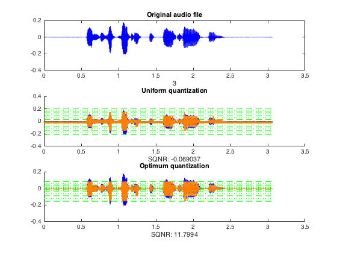
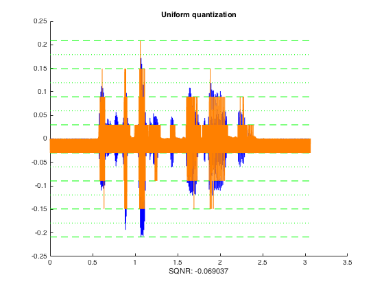
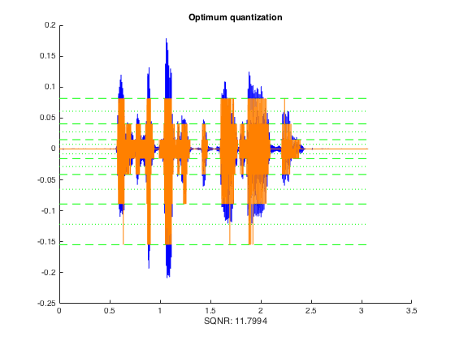

# Lloyd-Quantization
4J03 "Communication systems" Project

Visual comparison of uniform vs optimum quantization

##Overview

##Uniform Comression

##Optimum Compression

######Note:

*Test Audio "audioSample.wav" not given in repository*

*Sampling interval is hardcoded from 0.5 seconds to 2.5 seconds of the given audio sample (i.e. value defined as "start_sample" and "end_sample")*

